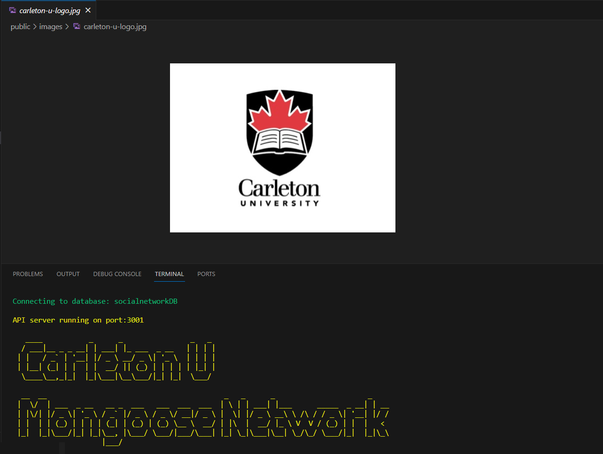
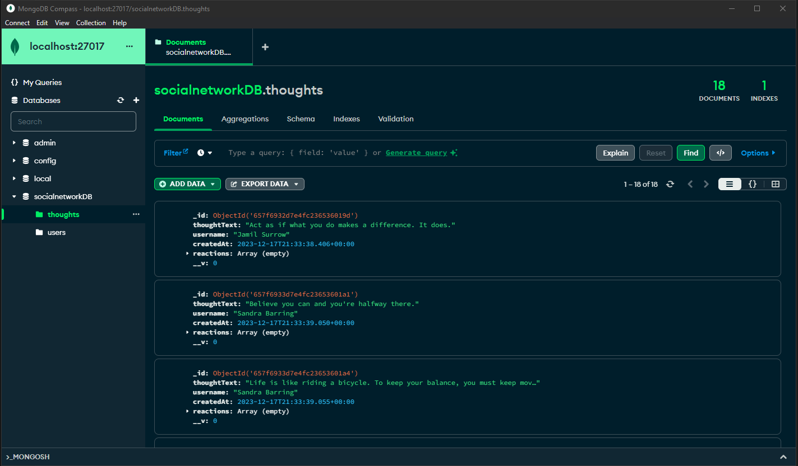
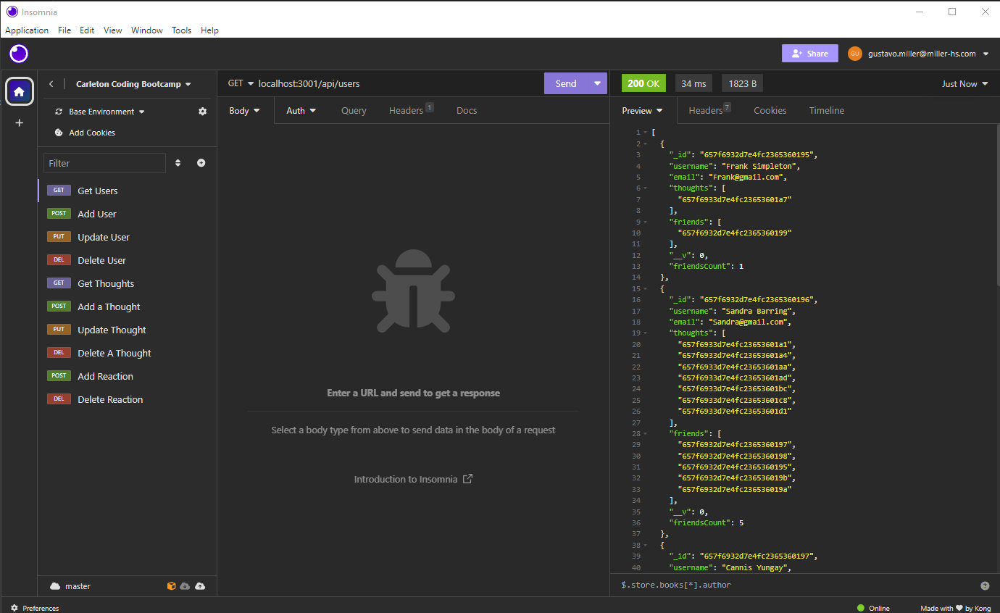
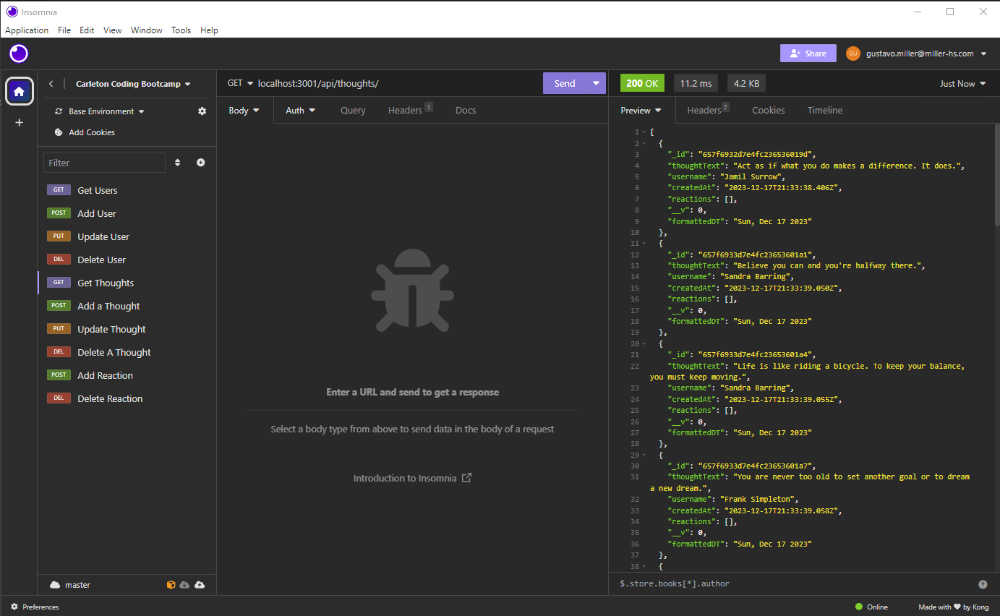

<a id="readme-top" name="readme-top"></a>

<p align="center"></p>

<p align="center" style="margin-top:25px; margin-bottom:50px;">
	<a></a>
	<a></a>
</p>

# Carlton Coding Bootcamp Certification

<details style="margin-bottom: 25px; margin-top: 25px;">
	<summary>Table of Contents</summary>
	<ol>
		<li><a href="#Description">Social Network API Description</a></li>
		<li><a href="#installation">Installation</a></li>
		<li><a href="#usage">Application Usage</a></li>
          <li><a href="#technology">Technology</a></li>
          <li><a href="#screenshots">Screen-shots</a></li>
		<li><a href="#contactme">Questions? Contact Me!</a></li>
          <li><a href="#license">License</a></li>
	</ol>
</details>

<div id="Description" style="margin-top: 25px;">

## Social Network API Description

This past week has been all about Mongodb. MongoDB is a very common NOSql Database out in the market, and it is the choice number one for social network applications. NoSQL Databases are non relational databases, designed for applications that need low latency and flexible models to manage large data volumes. In the databases world you either find MongoDb exciting but in other cases you will dispise it. It all depends on the developer's background.

It is because it is fast, reliable and very flexible. It can handle large volumes of data at high-speed, store unstructure, semi structured and even structured data. Every record in MongoDB collections does not depend upon the other records present in a particular collection on the basis of structure. We can add any new key in any record according to the need. There is no proper structure for the MongoDB collections and constraints on the collections.

This week's assignment is to build a social network API that would allow users share thoughts or react to friends thoughts and even create a friend's list. The application won't have an interface because it is an API, therefore we will rely on insomnia to access and create records. I mentioned before the one may like or dislike MongoDB based on their backgrounds, well, I am 25+ years SQL developer/modeller, I am not about to change now. 

Nevertheless here is my product. Yeahman-Go!

<div style="margin-top: 15px;">
	
</div>
</div>

<p align="right">(<a href="#readme-top">back to top</a>)</p>

<div id="installation" style="margin-bottom: 20px;margin-top: 20px;">

## Installation

The installation of this package is very simple. Before you start doing anything, make sure you install and configure successfully mongodb in your computer, as well as mongo compass interface application. Clone my application, seed database and test it. I have provided plenty of data to play around.

Please follow the instructions to install the MongoDB Social Network application

1. Install Node 18 or later.
2. Clone this repository : https://github.com/gusmiller/yeahmon-go
3. Run npm i to install the dependencies.
4. **Run npm start** to start the API server.
5. When you run the application for the first time, database will be creaed.
6. **Run npm seed** to seed database, once database is seeded goto #3

Important Note: you must have MongoDB installed and configured in your computer. We also recommend you install MongoDB Compass interface to review your collections. To install go to [MongoDB](https://www.mongodb.com/products/tools/compass) follow this installation guide. You may want to install npm dotenv, Dotenv is a zero-dependency module that loads environment variables from a .env file into process.env.

</div>

<p align="right">(<a href="#readme-top">back to top</a>)</p>

<div id="usage" style="margin-top: 25px;">

## Application Usage

This application was developed using ExpressJS Server For this application we are gonna need insomnia install in our computers. We could also use thunder client. If we are using video code. Either way the application should work. Since we are gonna be entering the commands manually, we need to know what are the roots we need.


### Environment Variables
I have included a .envSAMPLE to give you a start-up environmet file (you can create your own). In this file one can add all variables that we don't want to expose to the world such as IPs, domains, passwords and whatnot. Or simply, add some flags that would perform some action when turned ON.

```
     # NODE APP ENVIRONMENT VARIABLES
     PORT=3001

     # LOCAL DATABASE CONNECTION ENVIRONMENT VARIABLES
     DB_HOST=mongodb://127.0.0.1:27017/
     DB_NAME=socialnetworkDB
```

Dependancies included in the package.json:

```
     chalk version 4.1.2
     date-and-time version 3.0.3
     dotenv version 8.2.0
     express version 4.17.1
     figlet version 1.7.0
     mongoose version 7.0.2
     mongoose-validator version 2.1.0
```
<p align="right">(<a href="#readme-top">back to top</a>)</p>

</div>

<div id="screenshots" style="margin-top: 25px;">

## Screen-shots
Here are some of the screen-shots I took from the Users, Thoughts and Reactions. I have not included all possible conditionals but it will help you understa how the API works and where it could be enhanced.

<details style="margin-bottom: 25px; margin-top: 25px;">
<summary>The interface used to test the Network Database is Insomnia. Insomnia is a collaborative open source API development platform that makes it easy to build high-quality APIs — without the bloat and clutter of other tools.</summary>

<div style="margin-top: 15px;">
     
</div>

If you want to know more about Insomnia please visit their official [website](https://insomnia.rest/) for further information

</details>

<details style="margin-bottom: 25px; margin-top: 25px;">
<summary>The Users collection is simple but it contains two embedded subdocuments which makes it challenging to maintain. Users same as Thoughts have GET,PUT,POST and DEL endpoints to handle data. In this example we see the GET in action, it returns all the users available</summary>

<div style="margin-top: 15px;">
     
</div>

</details>

<details style="margin-bottom: 25px; margin-top: 25px;">
<summary>The Thoughts collection is similar to the Users, but instead of having an embedded collection it contains an abstract of a collection; Reactions. There is no Reactions collection but its schema is used to create a collection whithin the Thoughts. In the example below there are no thoughts with Reactions but in the video you can see this in action. This is just a teaser.</summary>

<div style="margin-top: 15px;">
     
</div>

</details>

To appreciate the whole application starting from scratch to end, please watch the [video](https://drive.google.com/file/d/1oXnxv97QT99dRlObCVyilqbk4Fb4h6PK/view?usp=sharing) I have prepared. Hope you enjoy it!

<p align="right">(<a href="#readme-top">back to top</a>)</p>

</div>

<div id="technology" style="margin-top: 25px;">

## Technology Stack

The following should list any major frameworks/libraries used to in the designing and coding of **Social Network Application**.

* <a href="https://www.npmjs.com/package/chalk"></a> Make message colorful and pleasing to the eye
* <a href="https://www.mongodb.com/products/tools/compass"></a> Compass. The GUI for MongoDB.
* <a href="https://www.npmjs.com/package/dotenv"></a> Dotenv environment variables
* <a href="https://www.npmjs.com/package/express"></a> The Express philosophy is to provide small, robust tooling for HTTP servers, making it a great solution for single page applications, websites, hybrids, or public HTTP APIs.
* <a href="https://developer.mozilla.org/en-US/docs/Web/javascript"></a> Use Javascript as the main language - used classes and module exports.
* <a href="https://www.npmjs.com/package/mongoose"></a> Mongoose is a MongoDB object modeling tool designed to work in an asynchronous environment. Mongoose supports Node.js and Deno (alpha).
* <a href="https://docs.insomnia.rest/insomnia/get-started#:~:text=Insomnia%20is%20an%20open%20source%20desktop%20application%20that,like%20authentication%20helpers%2C%20code%20generation%2C%20and%20environment%20variables"></a> Insomnia is an open source desktop application that takes the pain out of interacting with and designing, debugging, and testing APIs.

<p align="right">(<a href="#readme-top">back to top</a>)</p>

</div>

<div id="contactme" style="margin-top: 25px;">

## Questions? Contact Me 

The purpose of this MongoDB Social Network Application is to gain experience in building NoSQL databases driven by ExpressJS Server. The application has potential for much expansion and it can become something special.

Do not hesitate in contacting me, Gustavo Miller - gustavo.miller@miller-hs.com.

You may find the application at: [https://github.com/gusmiller/yeahmon-go](https://github.com/gusmiller/yeahmon-go)

</div>

<div id="license" style="margin-top: 25px;">

## License

For this project I have decided to use a different licence - trying to understand the differences between them. I have not customized the terms and conditions to the application in case. If one day I publish this application then I will, for now is up to you to make it yours.

Here is the License file: [GNU GENERAL PUBLIC LICENSE](LICENSE)

<a></a>

<p align="right">(<a href="#readme-top">back to top</a>)</p>

</div>

---
© 2023 edX Boot Camps LLC. Confidential and Proprietary. All Rights Reserved. Developed by Gustavo Miller.